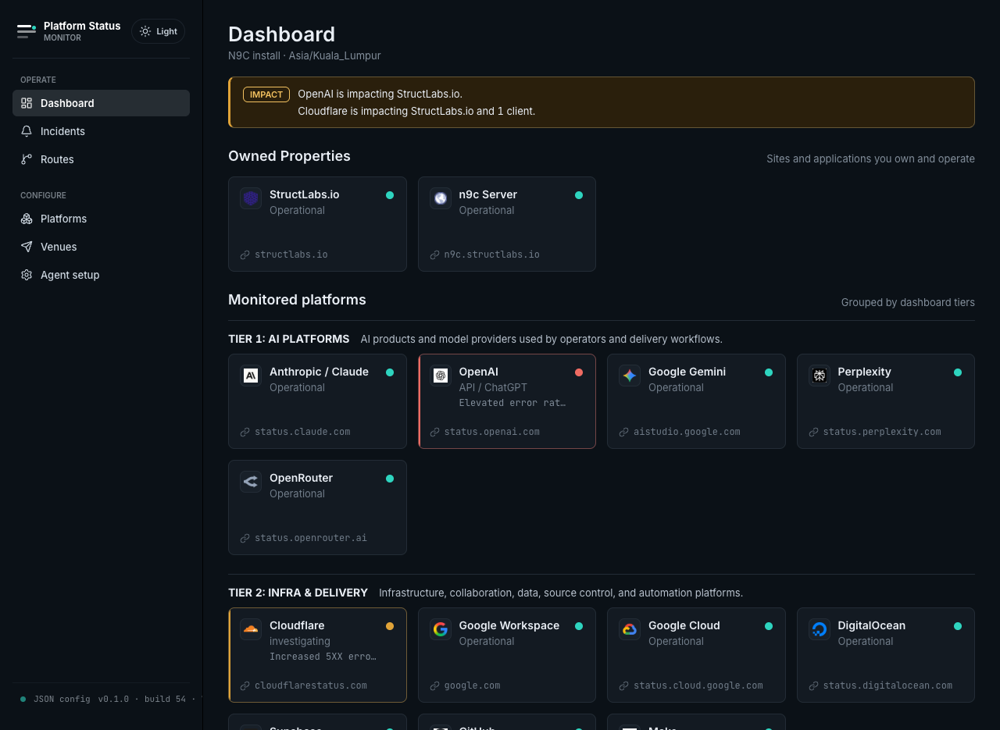
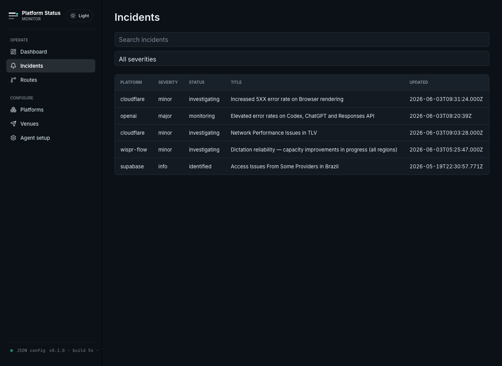
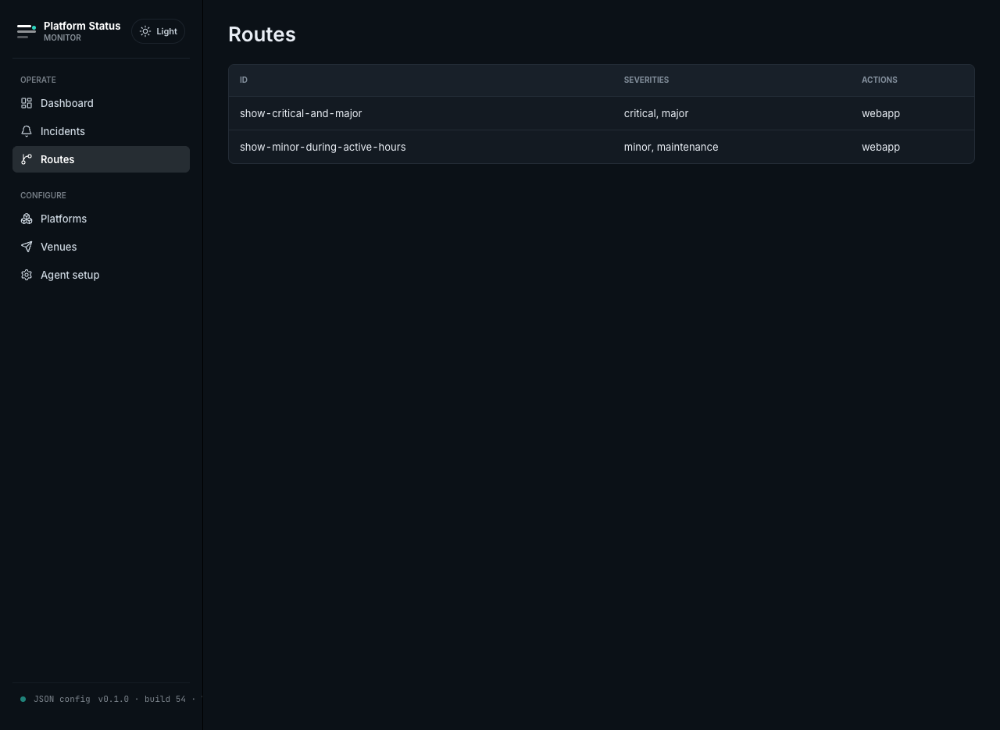
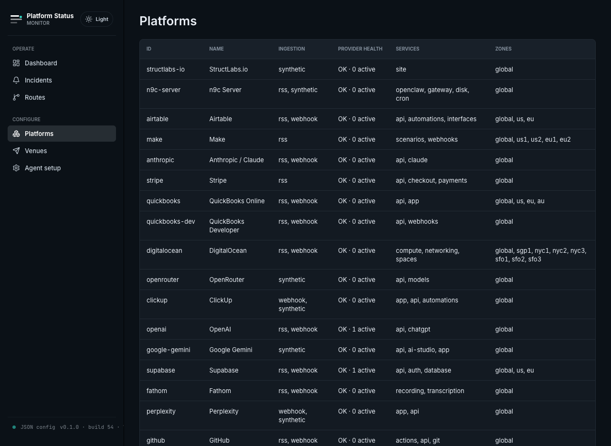
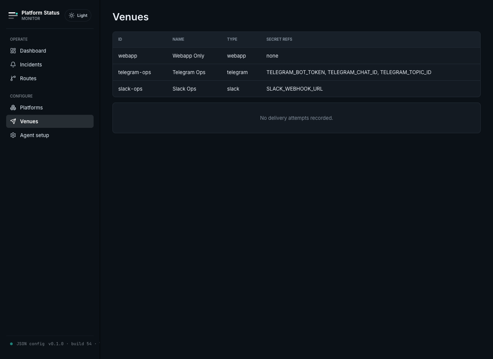
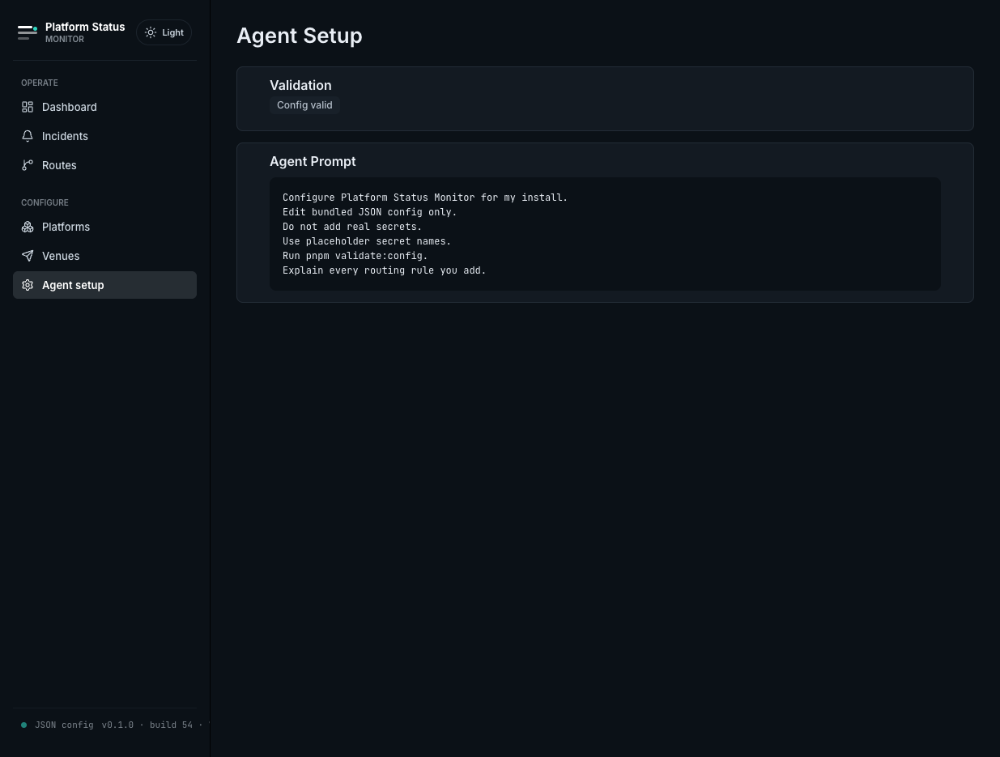

# Platform Status Monitor

Agent-configurable platform status monitoring for teams, agencies, and solo
operators.

The MVP uses bundled JSON configuration, a Cloudflare Worker for ingestion/API,
Workers KV for runtime state, and a read-only Next.js dashboard.

[](https://psm.structlabs.io/)

<br/>

<details>
<summary><b>More screenshots</b> — Incidents, Routes, Platforms, Venues, Agent Setup</summary>

<br/>

<table>
<tr>
  <td align="center"><a href="docs/screenshots/02-incidents.png"></a><br/><sub>Incidents</sub></td>
  <td align="center"><a href="docs/screenshots/03-routes.png"></a><br/><sub>Routes</sub></td>
  <td align="center"><a href="docs/screenshots/04-platforms.png"></a><br/><sub>Platforms</sub></td>
</tr>
<tr>
  <td align="center"><a href="docs/screenshots/05-venues.png"></a><br/><sub>Venues</sub></td>
  <td align="center"><a href="docs/screenshots/06-agent-setup.png"></a><br/><sub>Agent Setup</sub></td>
</tr>
</table>

</details>

## Status

The core MVP is complete.

- Read-only webapp
- JSON-first config
- Routing decisions for webapp and external venues
- Telegram and Slack delivery implemented (configure via `install.json` and Cloudflare secrets)

## Architecture

```text
status providers
  -> Cloudflare Worker
  -> normalized incidents and routing decisions in KV
  -> Next.js dashboard on Cloudflare Pages
```

## Local Development

Read [Prerequisites](docs/prerequisites.md) before setup.
Project and design context live in [PRODUCT.md](PRODUCT.md) and [DESIGN.md](DESIGN.md).

```bash
pnpm install
pnpm check
pnpm test
pnpm validate:config
```

Run the Worker:

```bash
pnpm --filter @platform-status-monitor/worker dev
```

Run the webapp:

```bash
pnpm --filter @platform-status-monitor/web dev
```

## Secrets

Never commit real tokens or webhook secrets. Use `.dev.vars` locally and
Cloudflare secrets in deployed environments.

## Deployment And CI

- Cloudflare setup is documented in [Cloudflare Deployment](docs/cloudflare-deployment.md).
- GitHub Actions are disabled in the public template by default. Use
  [GitHub Actions Setup](docs/github-actions.md) to enable CI in your own
  install.
